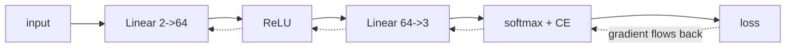

# neural-net-from-scratch

> **Backprop by hand, and proven correct.** A multilayer perceptron in **pure numpy** (no
> PyTorch, no TensorFlow) trained on a non-linear spiral, with a **gradient check** that
> matches analytical gradients to ~1e-6 and an accuracy gate. The repo that shows you
> understand the math under `model.fit()`.

[](https://github.com/tahasiddiquii/neural-net-from-scratch/actions/workflows/ci.yml)


Anyone can call a framework. This implements the whole thing: forward pass, hand-derived
backprop, softmax cross-entropy, SGD with momentum, and then does the thing most people skip:
**gradient-checks it**, so the derivatives are provably right, not just plausibly right.

## What this demonstrates

| Concept | Where |
| --- | --- |
| Layers that own their forward + local gradient | [layers.py](src/nnscratch/layers.py) |
| Softmax + cross-entropy (combined gradient) | [losses.py](src/nnscratch/losses.py) |
| Backprop = chain rule, layer by layer | [network.py](src/nnscratch/network.py) |
| SGD with momentum | [optim.py](src/nnscratch/optim.py) |
| **Numerical gradient checking** | [gradcheck.py](src/nnscratch/gradcheck.py) |

## Architecture



## Quickstart

```bash
make dev            # venv + install -e ".[dev]"   (numpy only)

nnscratch gradcheck     # verify backprop against finite differences
nnscratch benchmark     # train + gradient-check + gate
```

## Results

`nnscratch benchmark` ([report](reports/benchmark_report_example.md)), MLP `2 -> 64 -> 3` on a
3-arm spiral:

| metric | value | threshold |
| --- | --- | --- |
| train_accuracy | 0.9931 | n/a |
| test_accuracy | 0.9722 | ≥ 0.90 |
| **gradient_check** (max rel err) | **3.5e-08** | ≤ 1e-4 |
| final_loss | 0.0176 | n/a |

The load-bearing line is the **gradient check**: the analytical gradients from `backward`
match central finite differences to **3.5e-08**, which *proves* the backprop is correct. The
**97% test accuracy** then proves the network learns the curved boundary, something logistic
regression on this data cannot do.

## Why gradient checking is the point

A wrong gradient still trains a network, just badly, so bugs hide. The check perturbs each
parameter by ±ε, measures the change in loss, and compares that finite-difference slope to the
analytical gradient. Agreement to ~1e-6 means the calculus is right; a wrong derivative shows
up as a relative error near 1. It's the single most valuable habit when writing a net by hand,
and it's wired into the CI gate here.

## Design decisions

- **numpy only.** rich is used solely for the CLI table. The mechanics are the deliverable.
- **He initialization** keeps activation variance stable through ReLU.
- **Two-part gate.** Learning *and* a verified gradient, one without the other is luck or a bug.
- **Seeded end-to-end** (data, init, batching, check sampling) so every number reproduces.

## Layout

```
src/nnscratch/  data · layers · losses · network · optim · train · gradcheck · benchmark · cli
reports/  benchmark_report_example.md
```

## Related repositories

Part of a portfolio on production ML & LLM engineering:

- [ai-harness](https://github.com/tahasiddiquii/ai-harness) · [llm-eval-observability](https://github.com/tahasiddiquii/llm-eval-observability) · [llm-guardrails-redteam](https://github.com/tahasiddiquii/llm-guardrails-redteam) · [hybrid-graph-rag](https://github.com/tahasiddiquii/hybrid-graph-rag)
- [support-copilot](https://github.com/tahasiddiquii/support-copilot) · [invoice-ap-agent](https://github.com/tahasiddiquii/invoice-ap-agent) · [deep-research-agent](https://github.com/tahasiddiquii/deep-research-agent) · [vendor-risk-agent](https://github.com/tahasiddiquii/vendor-risk-agent) · [llm-router](https://github.com/tahasiddiquii/llm-router)
- [timeseries-forecasting](https://github.com/tahasiddiquii/timeseries-forecasting) · [tabular-ml](https://github.com/tahasiddiquii/tabular-ml) · [timeseries-classification](https://github.com/tahasiddiquii/timeseries-classification) · [drift-detection](https://github.com/tahasiddiquii/drift-detection)
- **neural-net-from-scratch**: this repo.

## License

MIT © 2026 Taha Siddiqui
