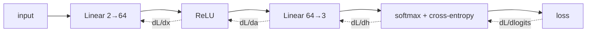

# Architecture

The whole point is the mechanics: what each piece computes forward, and what it sends back.

## Forward and backward

Backpropagation is just the chain rule applied layer by layer. Each layer caches what it
needs on the forward pass and, given the gradient of the loss w.r.t. its output, returns the
gradient w.r.t. its input while stashing the gradients w.r.t. its own parameters
([layers.py](src/nnscratch/layers.py)).

## The pieces

- **Linear**: `y = xW + b`. Backward: `dW = xᵀ·dout`, `db = Σ dout`, `dx = dout·Wᵀ`.
- **ReLU**: `max(0, x)`. Backward passes the gradient through only where the input was positive.
- **Softmax + cross-entropy**: paired because their combined gradient collapses to the clean
  `p − onehot(y)` ([losses.py](src/nnscratch/losses.py)).
- **SGD + momentum**: `v ← μv − lr·g; θ ← θ + v` ([optim.py](src/nnscratch/optim.py)).

## Gradient checking — the load-bearing idea

Backprop is easy to get subtly wrong, and a wrong gradient still *trains*, just badly. The fix
is a **gradient check**: perturb a parameter by ±ε, measure the change in loss, and compare
that finite-difference estimate to the analytical gradient
([gradcheck.py](src/nnscratch/gradcheck.py)). They agree to ~1e-6 here — which is the proof
the math is right. A wrong derivative shows up as a relative error near 1.

> A note on ReLU: finite differences are unreliable at the ReLU kink, so the check runs on a
> class-mixed batch (an all-one-class batch leaves units uniformly dead).

## The two-part gate

CI fails unless **both** hold: the network reaches **≥ 90% test accuracy** on the spiral (it
genuinely learns a boundary a linear model can't), *and* the **gradient check ≤ 1e-4** (the
backprop is correct). Learning without a verified gradient is luck; a verified gradient
without learning is a bug elsewhere — you want both.

## Reproducibility

The spiral, initialization, batching, and gradient-check sampling are all seeded. `make
report` regenerates every number in the README and
[example report](reports/benchmark_report_example.md).
